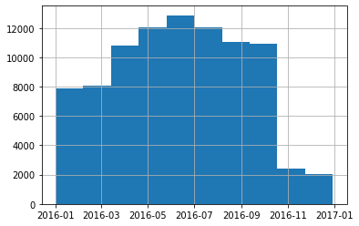
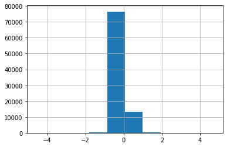
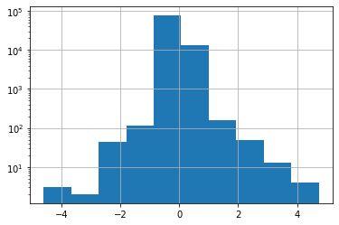
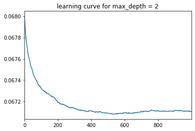
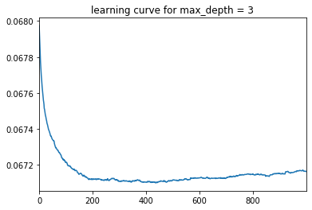
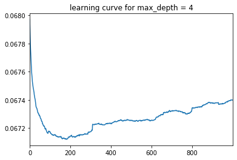
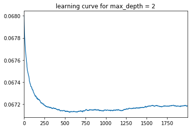

# Zillow_Home_Value_Prediction
Predicting the log-error between 'Zestimate' and actual home value

## Introduction
This project aims to predict the log(error) of Zillow’s estimate ('Zestimate') and the actual sale prices in California for a specified number of months in 2016 and 2017. According to the National Association of Realtors, more than 5 million units of existing homes were sold in the US in 2020. Home purchase signifies a significant expense for any individual, therefore, a lot of research goes into buying a home. Home price estimates would give the seller and the buyer a reference point, which would thus reduce the time and effort of both parities involved. As a result, a good home price estimate would reduce a lot of unnecessary cost, and would help both the buyers and sellers.

In this project, I use the dataset provided by Zillow for a Kaggle competition, and apply linear and gradient boosting regression to predict the log(error) of Zillow’s estimate. I use the Mean Absolute Error to evaluate the model as it is mathematically easy to define and we can figure out the difference in the price error of the estimate.

## Data
The data for this project comes from Zillow for a Kaggle competition. The dataset 60 features that described the location, year built, square footage, number of bedrooms and bathrooms, tax amount, among many others. The model aims to predict the log(error), which is described as:

logerror = log(Zestimate) - log(SalePrice)

## Exploratory Data Analysis
To save on memory, I explored the number of properties in my dataset that did not have a matching train record. I found that almost 3 million properties did not have corresponding target data (those properties did not sell, therefore, we do not know the sale price), so those entries were separated out. 

One thing I did during the initial analysist was to check the range for the different transaction dates and it is visualized below:

I also found that some of the homes were sold twice during the period that the training data was captured which left multiple records for a particular parcelId. 
Because only ~100 of the ~90,000 properties had multiple records, we chose to just take a random sales record for each parcel with more than one sales record (as opposed to... always using the most recent record, always using the oldest record, using both records, or engineering a feature from the info).

When exploring Unique Values in the dataset a few things that I looked for are:
* Are any of the features all of the same value? These won't be useful in a model, so I discarded them
* Are any features discrete with high cardinality? These wouldn't hold very much information because there would only be a few records for each "level" of the categorical feature

I also found it interesting to explore the Target Variable, shown below:

I keep this in mind when choosing Machine Learning Algorithms and corresponding loss functions. When I plotted the density on a log-scale, the target looks closer to a Normal Distribution:

## Preprocessing & Feature Engineering
By creating a preprocessing tool instead of script, preprocessed data file, I was able to change things on the fly during the model build process and speed up iterations.
In the `02_Preprocessing` Notebook, I did some feature engineering and missing value imputation. Including:
* Filter features
* Encoding missing values with a unique value (for that column)
* Encoding categorical features for us in common Machine Learning algorithms

One example that required `encoding` was the datetime column. For this, I encoded the datetime variable as month and year (disregard day because it won't be included in the data we'll be scoring).

Because most Machine Learning Algorithms do not handle categorical features well, I encoded them as a real number. To be flexible during modeling, I encoded a set of categorical variables with a set of binary features (`dummy encoding`). 

## Modeling
#### Defining success
The final model parameters was based on the evaluation criteria used by the Kaggle competition, Mean Squared Error (MAE).
#### Tune tree depth
`learning_rate` and `max_estimators` are indirectly-correlated; the higher the learning rate the fewer trees are needed. Increasing the learning rate will make the models fit faster. This comes with a bit of a hit to accuracy though, so a popular technique is to tune the tree depth with a higher learning rate and then tune the number of trees with a lower learning rate.

While training the model, I looked at the learning curve and compared the MAE of models with a max depth of 2, 3, and 4.

***** training for max depth = 2 *****
optimal number of trees: 538
best MAE: 0.0670813421874875
baseline MAE: 0.06803804369747765

***** training for max depth = 3 *****
optimal number of trees: 435
best MAE: 0.06709945059252274
baseline MAE: 0.06803804369747765

***** training for max depth = 4 *****
optimal number of trees: 182
best MAE: 0.06711932431156699
baseline MAE: 0.06803804369747765

The final parameters settled on were:
* n_estimators = 1000
* learning_rate = 0.1
* max_depth = 2
* loss = 'lad'
* subsample = 0.5

optimal number of trees: 560
best MAE: 0.06712509883803039
baseline MAE: 0.06803804369747765

#### Create model object
I used a Scikit-Learn Pipeline to combine the preprocessing and GBM steps in one package. The pipeline object called `my_model` implements `fit` and `predict` methods (among others). When we call the `fit` method, the pipeline will execute `preprocessor.fit_transform()` on the data we pass in the arguments, then pass the results to `GradientBoostingRegressor.fit()`. Similarly, when we call the `predict` method, it will execute `preprocessor.transform()` and then `GradientBoostingRegressor.predict()`.

## Results

## Next Steps

## Appendix
